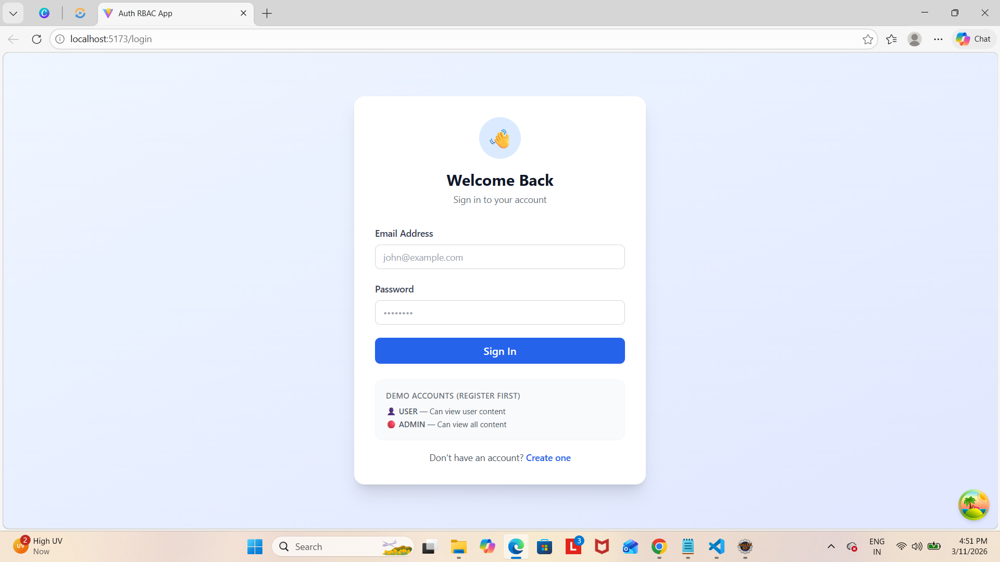
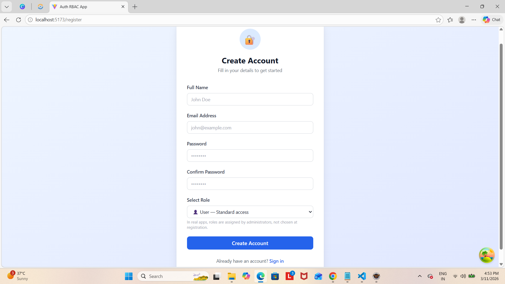
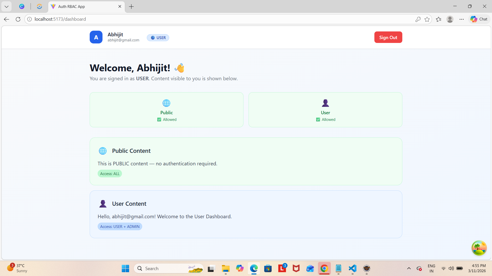
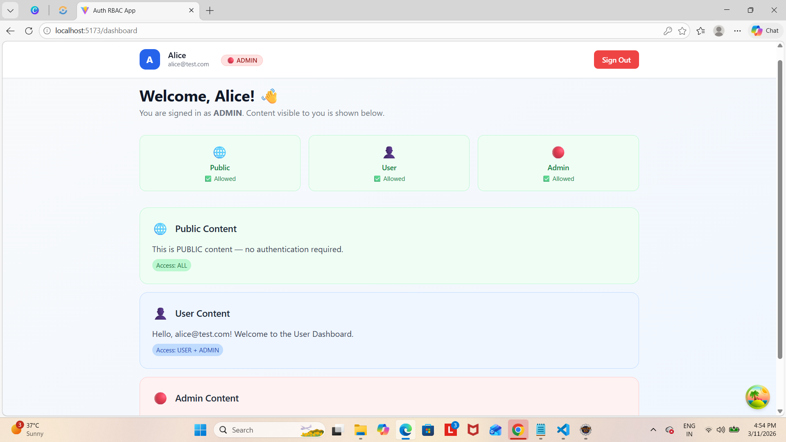

# 🔐 Full Stack Authentication & RBAC System

A full-stack web application demonstrating **JWT-based Authentication** and **Role-Based Access Control (RBAC)** built with **Spring Boot** (backend) and **React + TypeScript** (frontend).

---

## 📸 Screenshots

### Login Page


### Register Page


### Dashboard — USER Role


### Dashboard — ADMIN Role

---

## 🛠️ Tech Stack

### Backend
| Technology | Purpose |
|------------|---------|
| Java 17 | Programming language |
| Spring Boot 3.2 | Application framework |
| Spring Security | Authentication & authorization |
| Spring Data JPA + Hibernate | Database ORM |
| MySQL | Relational database |
| JWT (jjwt 0.12.3) | Stateless token authentication |
| Lombok | Boilerplate reduction |
| MapStruct | DTO mapping |
| Swagger / OpenAPI | API documentation |
| Maven | Build tool |

### Frontend
| Technology | Purpose |
|------------|---------|
| React 18 + TypeScript | UI framework |
| Vite | Build tool & dev server |
| React Router v6 | Client-side routing |
| TanStack React Query | Server state management |
| Axios | HTTP client with interceptors |
| React Hook Form | Form handling & validation |
| TailwindCSS | Utility-first styling |

---

## ✨ Features

- ✅ User registration with name, email, password, and role
- ✅ User login with JWT token response
- ✅ Password validation (min 8 chars, uppercase, lowercase, digit)
- ✅ Role-based access control (USER / ADMIN)
- ✅ Protected API endpoints per role
- ✅ Protected frontend routes
- ✅ JWT auto-attached to every API request via Axios interceptor
- ✅ Role-based UI — admin content completely hidden from USER role
- ✅ Logout functionality
- ✅ Loading & error states
- ✅ Responsive UI with mobile sidebar
- ✅ Global exception handling with clean JSON error responses
- ✅ Swagger UI for API documentation

---

## 📁 Project Structure

```
├── auth-backend/                          # Spring Boot Backend
│   └── src/main/java/com/example/authbackend/
│       ├── AuthBackendApplication.java    # Entry point
│       ├── config/
│       │   ├── SecurityConfig.java        # Spring Security + CORS config
│       │   ├── OpenApiConfig.java         # Swagger configuration
│       │   └── GlobalExceptionHandler.java# Centralized error handling
│       ├── controller/
│       │   ├── AuthController.java        # /api/auth/register, /api/auth/login
│       │   └── ContentController.java     # /api/public, /api/user, /api/admin
│       ├── dto/
│       │   ├── RegisterRequest.java       # Registration request body
│       │   ├── LoginRequest.java          # Login request body
│       │   ├── AuthResponse.java          # Token + user info response
│       │   └── ErrorResponse.java         # Consistent error response
│       ├── entity/
│       │   ├── User.java                  # User JPA entity
│       │   └── Role.java                  # USER / ADMIN enum
│       ├── repository/
│       │   └── UserRepository.java        # Spring Data JPA repository
│       ├── security/
│       │   ├── JwtService.java            # JWT generation & validation
│       │   └── JwtAuthFilter.java         # JWT request filter
│       └── service/
│           ├── AuthService.java           # Register & login logic
│           └── UserDetailsServiceImpl.java# Spring Security user loader
│
└── auth-frontend/                         # React + TypeScript Frontend
    └── src/
        ├── api/
        │   ├── axios.ts                   # Axios instance with JWT interceptor
        │   └── authApi.ts                 # API call functions
        ├── components/
        │   ├── ProtectedRoute.tsx         # Route guard component
        │   ├── RoleBadge.tsx              # USER / ADMIN badge
        │   └── LoadingSpinner.tsx         # Reusable spinner
        ├── context/
        │   └── AuthContext.tsx            # Global auth state
        ├── pages/
        │   ├── LoginPage.tsx              # Login form
        │   ├── RegisterPage.tsx           # Registration form
        │   └── DashboardPage.tsx          # Role-based dashboard
        ├── types/
        │   └── auth.ts                    # TypeScript interfaces
        └── App.tsx                        # Routes configuration
```

---

## 🔒 API Endpoints

| Method | Endpoint | Access | Description |
|--------|----------|--------|-------------|
| POST | `/api/auth/register` | Public | Register new user |
| POST | `/api/auth/login` | Public | Login and get JWT |
| GET | `/api/public` | Public | Public content |
| GET | `/api/user` | USER + ADMIN | User-level content |
| GET | `/api/admin` | ADMIN only | Admin-level content |

### Swagger UI
After running the backend, visit:
```
http://localhost:8080/swagger-ui.html
```

---

## ⚙️ Getting Started

### Prerequisites

| Tool | Version | Download |
|------|---------|----------|
| Java JDK | 17+ | https://adoptium.net |
| Maven | 3.8+ | https://maven.apache.org |
| Node.js | 18+ | https://nodejs.org |
| MySQL | 8.0+ | https://dev.mysql.com |

---

### 🗄️ Database Setup

```sql
CREATE DATABASE authdb;
```

---

### 🚀 Backend Setup

**1. Clone and navigate:**
```bash
cd auth-backend
```

**2. Update database credentials in `src/main/resources/application.properties`:**
```properties
spring.datasource.url=jdbc:mysql://localhost:3306/authdb
spring.datasource.username=root
spring.datasource.password=YOUR_PASSWORD
```

**3. Run:**
```bash
mvn spring-boot:run
```

Backend runs on → `http://localhost:8080`

> Hibernate will automatically create the `users` table on first run.

---

### 💻 Frontend Setup

**1. Navigate to frontend:**
```bash
cd auth-frontend
```

**2. Install dependencies:**
```bash
npm install
```

**3. Start dev server:**
```bash
npm run dev
```

Frontend runs on → `http://localhost:5173`

---

## 🔑 How JWT Authentication Works

```
1. User registers / logs in
         ↓
2. Backend verifies credentials
         ↓
3. Backend generates JWT token (contains email + role)
         ↓
4. Frontend stores token in localStorage
         ↓
5. Axios interceptor attaches token to every request:
   Authorization: Bearer <token>
         ↓
6. JwtAuthFilter reads & validates token on each request
         ↓
7. Spring Security checks role against endpoint rules
         ↓
   ✅ Allowed → returns data
   ❌ Denied  → returns 403 Forbidden
```

---

## 👥 Role Access Rules

| Role | `/api/public` | `/api/user` | `/api/admin` | Admin UI |
|------|:---:|:---:|:---:|:---:|
| Not logged in | ✅ | ❌ | ❌ | ❌ |
| USER | ✅ | ✅ | ❌ | Hidden |
| ADMIN | ✅ | ✅ | ✅ | Visible |

---

## 🧪 Testing with Postman

**Register:**
```json
POST http://localhost:8080/api/auth/register
Content-Type: application/json

{
  "name": "Alice",
  "email": "alice@test.com",
  "password": "Password1",
  "role": "ADMIN"
}
```

**Login:**
```json
POST http://localhost:8080/api/auth/login

{
  "email": "alice@test.com",
  "password": "Password1"
}
```

**Call protected endpoint:**
```
GET http://localhost:8080/api/admin
Authorization: Bearer <paste token here>
```

---

## 🌐 Environment Configuration

### Backend (`application.properties`)
```properties
spring.datasource.url=jdbc:mysql://localhost:3306/authdb
spring.datasource.username=root
spring.datasource.password=yourpassword
jwt.secret=your-secret-key-min-32-chars
jwt.expiration=86400000
```

### Frontend (`src/api/axios.ts`)
```typescript
const api = axios.create({
  baseURL: 'http://localhost:8080', // Change for production
});
```

---

## 🚨 Common Issues & Fixes

**`ClassNotFoundException: AuthorizationDeniedException`**
```java
// Replace in GlobalExceptionHandler.java:
// ❌ import org.springframework.security.authorization.AuthorizationDeniedException;
// ✅ import org.springframework.security.access.AccessDeniedException;
```

**`Failed to connect to MySQL`**
- Make sure MySQL service is running
- Check credentials in `application.properties`

**`Port 8080 already in use`**
```properties
server.port=8081
```

**Lombok annotations not working in Eclipse**
- Download `lombok.jar` from https://projectlombok.org
- Double-click the jar → Install → Restart Eclipse

---

## 🙌 Author

Built as a full-stack learning project demonstrating JWT authentication and role-based access control with Spring Boot and React.
